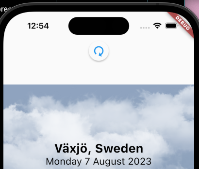
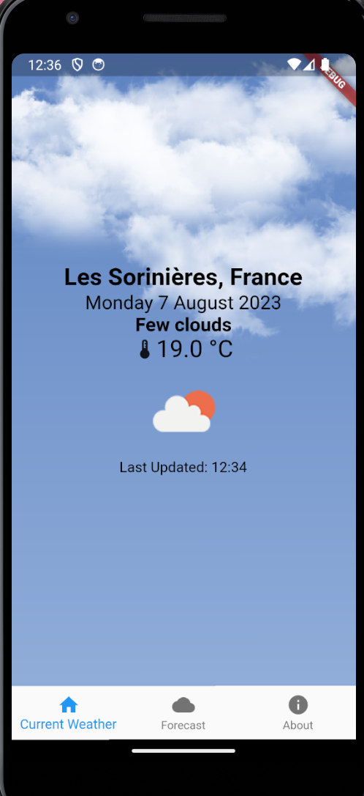
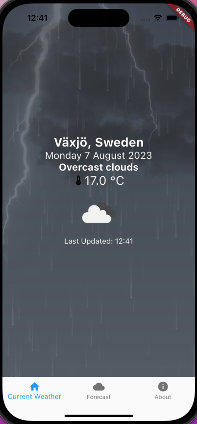
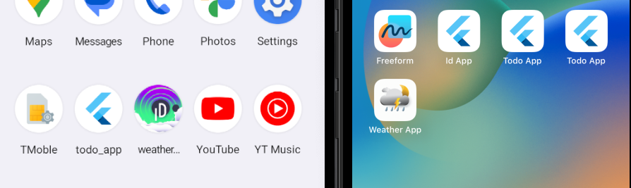
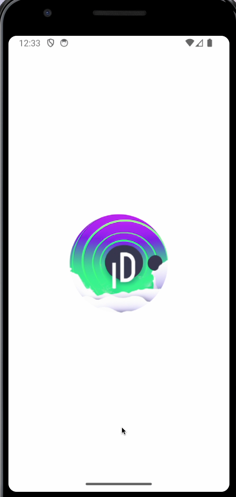
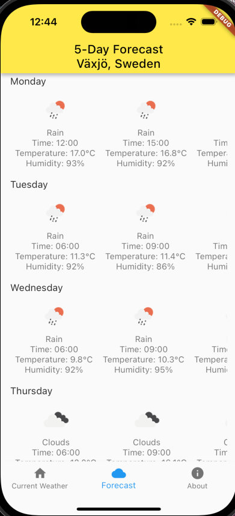
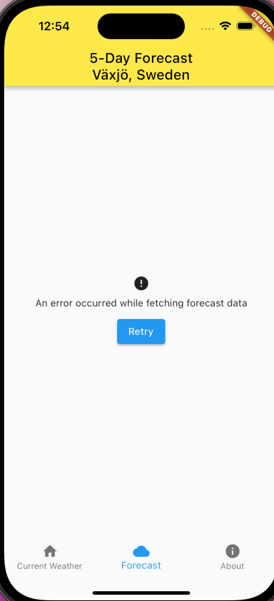

# Assignment 3

## The Weather App

### Course: 1DV535
### Author: Michael Daun

---

## Features

### Platform Support
- Available for both iOS and Android.
- APK file was last verified on a real device in 2023. Compatibility with newer Android versions is not guaranteed.

### App Refresh
- Drag to reload feature.
  - 

### Animated Backgrounds
- 15 different background animations matching current weather.
- Credit to [xiaweizi](https://pub.dev/packages/flutter_weather_bg_null_safety).
- Note: The thunder animation picture has been forced for showcase purposes and may not match the description.
  - 
  - 

### Custom Icons and Loading Screens
- AI-generated (Dall-E 2) custom icons and loading images.
  - 
  - 

### Weather Forecast
- Five-day weather forecast.
  - 

### Error Handling
- User-friendly error messages.
  - 

### Additional Features
- Dynamic text color based on weather/time.
- Evening and day-specific animations.
- Subtle animation on the About screen.
- And much more!
