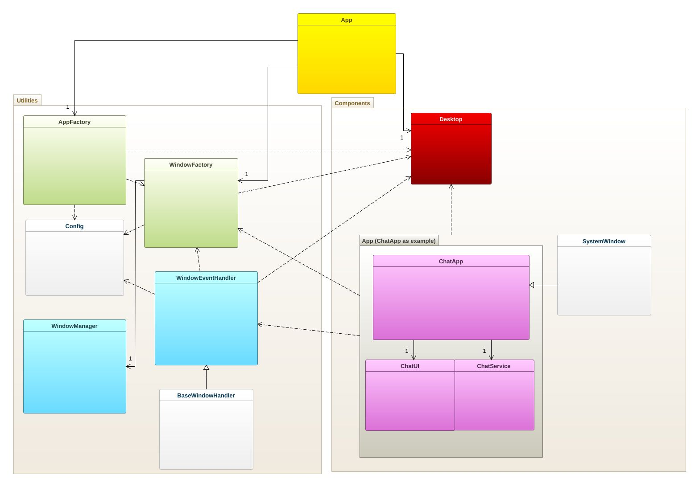

# A3 Personal Web Desktop (PWD)

This SPA (Single Page Application) acts as a “Personal Web Desktop” where you can launch applications, such as a Memory Game, Chat App. All in a synthwave inspired package!

## Getting Started

1. Clone the repository:

  ``` bash

  git clone git@gitlab.lnu.se:1dv528/student/md222fx/a3-spa.git
  cd a3-spa 
  ```

2. Install dependencies:

  ``` bash
  npm install
  ```

3. Build the SPA

  ``` bash
npm run build
  ```

4. Run the application

  ``` bash
  npm run http-server dist
  ```


## F8

The code is organized into two main folders: **"components"** and **"utils"**. Additional resources, such as icons, images, and sounds, are placed in separate folders named **"icons"**, **"img"**, and **"sounds"**, respectively.

The **"components"** folder contains the applications of the Personal Web Desktop (PWD). Each application is contained within its own folder, alongside its essential files. The exceptions to this are **Desktop.js** and **SystemWindow.js**, which are considered standalone files. The **Desktop.js** file contains the main HTML structure for the desktop. Its primary purpose (besides applying a background) is to create a main container for custom elements to reside in. The **SystemWindow.js** file serves as a base class for application files, ensuring a consistent and coherent structure. It includes logic for standard buttons, such as minimize, maximize, and close functions, among other features.

The **"utils"** folder contains non-visual components or elements that are not standalone applications. This folder includes files related to handlers that enable window resizing and repositioning. It also houses factories used for setting up applications.

The **AppFactory** class creates app icons and places them in the app bar. It also defines the actions triggered when an icon is pressed. This leads to the **WindowFactory** class, which performs much of the heavy lifting. It creates the actual application, combines it with a **WindowEventHandler**, and sets up an instance of the **WindowManager**. The **WindowManager** ensures that windows are not placed out of bounds and manages their z-index.

Every application created has its own instance of a **WindowEventHandler**, which handles user interactions, such as repositioning and resizing windows.

Finally **HelperFunctions.js** provides generic functions that could be used by any class and **Config.js** gives essentials paths to resources and other types of specifics configurations required by applications.


